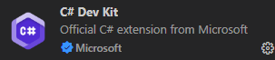

> [!CAUTION]
> If you already have VS Code installed, CLOSE IT before doing any of the steps. Do the steps as normal and wait to open VS Code until section 3.3 

# 1. Download .NET SDK
- **Step 1** Go to the [Download .NET page](https://dotnet.microsoft.com/en-us/download) and get the installer for your system.
- **Step 2** Run the installer and complete the steps.

# 2. Downloading Visual Studio Code
- **Step 1** Go to the [Visual Studio Code download page](https://code.visualstudio.com/download) and get the installer for your system.
- **Step 2** Run the installer and complete the steps.
- **Step 3** Open Visual Studio Code and complete any necessary welcome page steps.

# 3. Set Up C# Dev Kit
- **Step A1** Go to the [C# Dev Kit Download Page](https://marketplace.visualstudio.com/items?itemName=ms-dotnettools.csdevkit) and install the extension.

> **If step A doesn't work for you, try step B instead!**

- **Step B1** In Visual Studio Code, locate the extensions tab on the sidebar.
- **Step B2** In the search bar of the extensions tab, type `C# Dev Kit`.
- **Step B3** Find the 'C# Dev Kit' by Microsoft extension, select and download it.

‎ 
- **Step 2** Make sure you are clicked out of the search bar and press `cmd` + `shift` + `p` to open the 'Command Pallet'
- **Step 3** Type `.NET: Sign into Visual Studio account` and press `enter` (or click on the option at top of the screen)
- **Step 4** Follow the steps in the browser to sign into your Microsoft account (you can click back into VS Code when done)

# 4. Creating A Project
- **Step 1** In VS Code, open the Command Pallet and type `.NET: New Project...`
> **You may have to wait a little bit for the next menu to pop up!**

- **Step 2** Choose the template you want to use (for this class choose `Console App`)
- **Step 3** Give the project a name and press `enter`
- **Step 4** You will be asked if you want to use the current directory or change it (this is where you project gets saved), if you like the default choose the first option. Otherwise pick the second option, choose a new folder location, then pick the first option.
- **Step 5** Click `Create project', it should now appear under the 'Explorer' tab.

# 5. Running A Project
- **Step 1** While in the main `.cs` file of your project, press the "play" button in the top right of the editor.
> **You should see a new terminal in the bottom of the editor, if it says `Press any key to close` and doesn't go away, click on the terminal and press any key. After it is gone you should have a new terminal with your project's output.**
